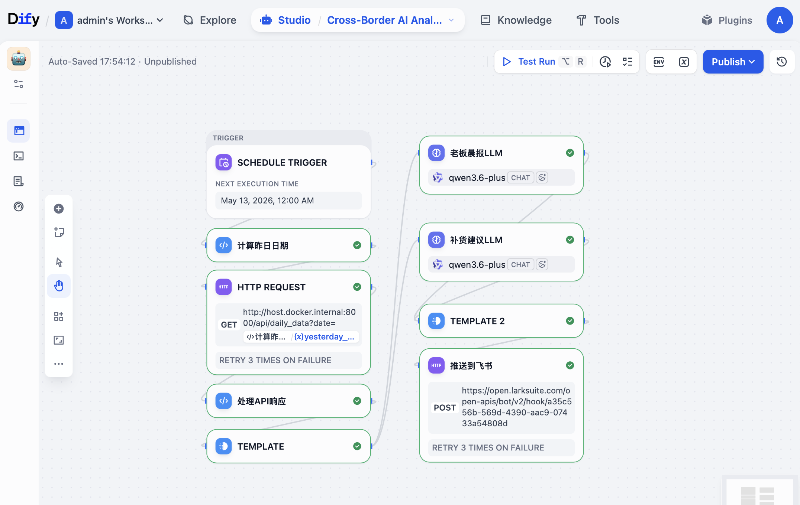
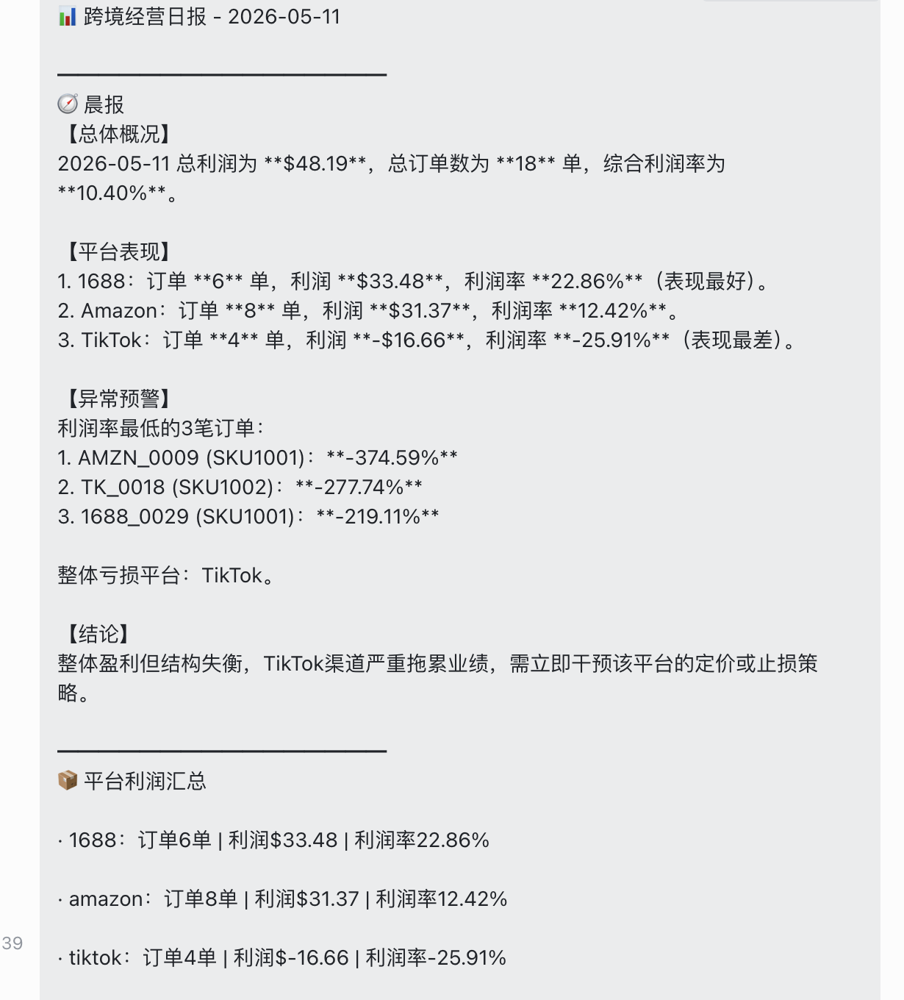

# Cross-Border AI Analyst PoC

> 跨境电商经营分析AI员工原型验证 – 基于 Dify 工作流 + 飞书推送的智能体 PoC

[](https://opensource.org/licenses/MIT)

## 📌 项目背景

为 **明星数智** 这类技术驱动的跨境企业，构建一个可演示的 AI 员工原型。该 AI 员工每日自动完成多平台（Amazon、TikTok、1688）订单数据获取、利润分析、异常预警，并推送决策导向的晨报和补货建议。

## 🎯 核心亮点

- **AI Native 设计**：定义 7 个核心 Skill（多源数据获取、指标计算、利润归因、补货建议等），并通过 Dify 工作流串联。
- **快速原型验证（PoC）**：15-20 小时内完成从数据模拟、API 搭建、Dify 工作流到飞书推送的全链路实现。
- **明确价值交付**：结果包（Result Pack）包含老板晨报、平台利润明细、补货建议表格、异常订单预警，可直接用于决策。
- **低代码 + 可扩展**：基于 Dify 可视化工作流，后续可轻松接入真实 API、替换 LLM 模型或增加新 Skill。

## 🧱 整体架构

```
┌─────────────────┐     ┌─────────────────────────────────────┐     ┌──────────────┐
│  模拟数据源      │     │            Dify 工作流               │     │   飞书机器人  │
│ amazon.csv      │────▶│  HTTP Request → Code → LLM1 → LLM2  │────▶│  推送结果包  │
│ tiktok.csv      │     │       (数据获取)  (指标计算) (简报) (补货)│     │              │
│ 1688.csv        │     └─────────────────────────────────────┘     └──────────────┘
└─────────────────┘              ▲                                            │
                                  │ 调用本地 API                              │
                          ┌───────┴───────┐                                  │
                          │  FastAPI 服务 │                                  │
                          │ /api/daily_data│                                  │
                          └───────────────┘                                  │
                                                                             ▼
                                                                    老板接收决策信息
```

## 🛠️ 技术栈

| 类别         | 技术                                 |
| ------------ | ------------------------------------ |
| 工作流编排    | Dify（可视化 Workflow）              |
| 后端 API     | Python + FastAPI + Pandas            |
| 模拟数据     | CSV（36 条订单，覆盖3天）           |
| LLM          | GPT-3.5-turbo（通过 Dify 调用）      |
| 消息推送     | 飞书自定义机器人 Webhook              |
| 版本控制     | Git + GitHub                         |

## 🧠 Skill 矩阵（共7个核心技能）

| Skill 名称         | 能力描述                         | 对应 Dify 节点         |
| ------------------ | -------------------------------- | ---------------------- |
| 1. 多源数据获取    | 调用本地 API 获取当日订单        | HTTP Request           |
| 2. 数据清洗与聚合  | 统一字段、合并多平台数据         | 前置 API 内置 / Code   |
| 3. 经营指标计算    | 计算利润、利润率、盈亏状态       | Code                   |
| 4. 利润归因分析    | 识别亏损订单和平台               | LLM1（老板晨报）       |
| 5. 补货智能建议    | 基于周转和利润给出 SKU 建议      | LLM2（补货建议）       |
| 6. 结果包组装      | 打包成结构化文本                 | Template Transform     |
| 7. 多渠道推送      | 通过飞书机器人发送消息           | HTTP Request           |

## 📦 Result Pack 结果包定义

详见 [`RESULT_PACK_DEFINITION.md`](./RESULT_PACK_DEFINITION.md)

结果包含四个部分：
- **晨报**：总利润、订单数、平台对比、异常预警、结论
- **平台利润明细**：各平台订单数、利润、利润率表格
- **补货建议表格**：SKU 级别优先级和建议补货量
- **异常订单预警**：利润率最低的5个订单

示例见 [`sample_result_pack/2026-05-11_report.md`](./sample_result_pack/2026-05-11_report.md)

## 🚀 快速复现步骤

### 前置要求
- Python 3.9+
- Dify 实例（本地 Docker 或 Dify Cloud）
- 飞书群聊自定义机器人 Webhook URL

### 1. 克隆仓库
```bash
git clone https://github.com/KaniGAO/cross-border-ai-analyst-poc.git
cd cross-border-ai-analyst-poc
```

### 2. 安装依赖并启动数据 API
```bash
python -m venv venv
source venv/bin/activate  # Windows: venv\Scripts\activate
pip install fastapi uvicorn pandas
python api/main.py
```
API 将在 `http://localhost:8000` 运行。

### 3. 导入 Dify 工作流
- 登录 Dify，创建空白工作流。
- 参考本文档中的架构图，手动创建节点并配置（或导入提供的 DSL 文件 `dify/Cross-Border AI Analyst PoC.yml`）。
- 关键配置：
  - HTTP Request 节点 URL：使用 `http://host.docker.internal:8000/api/daily_data`（如果 Dify 在 Docker）或 `http://你的局域网IP:8000/...`
  - LLM 节点：填入可用的 API Key（Dify 系统级别配置）。
  - 飞书推送节点：填入你的 Webhook URL。

### 4. 运行工作流
- 在 Dify 中点击"运行"，输入日期（如 `2026-05-11`）。
- 检查飞书群是否收到消息。

## 📁 项目结构

```
cross-border-ai-analyst-poc/
├── api/
│   └── main.py
├── data/
│   ├── amazon.csv
│   ├── tiktok.csv
│   └── 1688.csv
├── dify/
│   └── Cross-Border AI Analyst PoC.yml  # Dify 工作流 DSL
├── docs/
│   ├── workflow_overview.png
│   └── feishu_message.png
├── sample_result_pack/
│   └── 2026-05-11_report.md
├── scripts/
│   └── generate_orders.py
├── RESULT_PACK_DEFINITION.md
├── README.md
└── requirements.txt
```

## 🔧 Dify 工作流实现



## 📱 飞书推送效果



## 🔮 扩展

- 接入真实平台 API（Amazon SP-API、TikTok Shop API）
- 增加历史数据对比（环比、同比）
- 支持钉钉/企业微信/邮件推送
- 使用更强大的 LLM（GPT-4）提升分析深度
- 构建多 Agent 协作（选品、广告优化等）

## 📄 许可证

MIT © [高康麟]
