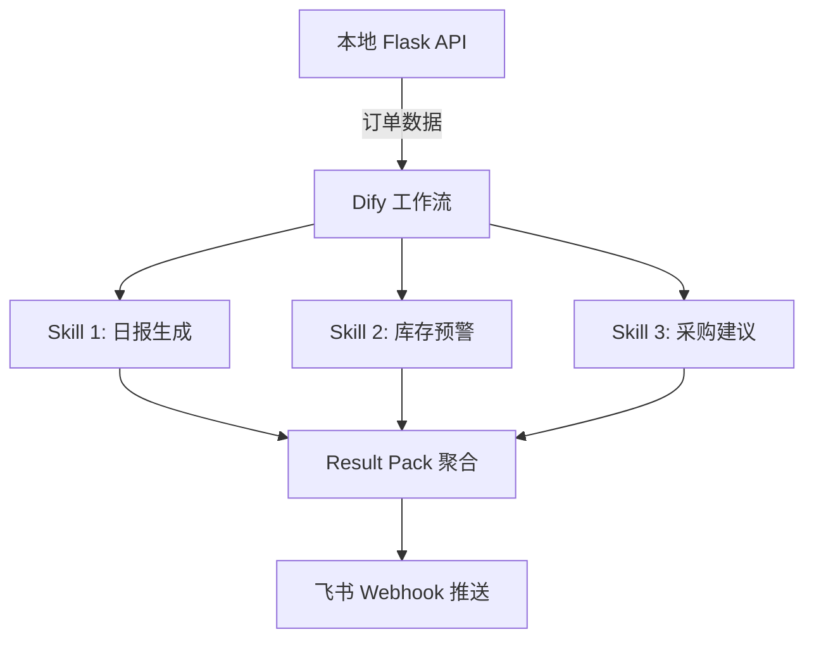

# cross-border-ai-analyst-poc

**跨境电商经营分析 AI 员工原型验证**  
基于 Dify 工作流 + 飞书机器人，打造一个能自动完成每日利润分析、库存预警、选品建议的 AI 经营分析师。

---

## 1. 项目背景

AAA（虚构）是一家多平台跨境卖家，同时在 **亚马逊、TikTok Shop、1688** 经营。  
管理层每天需要回答以下问题：

- 昨天各个平台赚了多少钱？哪些商品在亏损？
- 哪些 SKU 库存周转过慢，风险高？
- 1688 最近的采购价波动如何？有没有替代供应商？

这些问题靠人工查 Excel 或后台报表太慢、太累、容易出错。  
本 PoC 验证一种 **AI 员工模式**：通过 Dify 工作流编排多个 Skill，定时拉取订单数据，自动生成分析报告并推送到飞书群。

---

## 2. 整体架构（占位）



> 注：架构图将在任务 9 细化，当前为占位版本。

## 3. 核心亮点

- **Skill 矩阵**：设计了一组可复用的分析 Skill（日报 / 预警 / 推荐），通过 Dify 的 API 节点串联。
- **Result Pack**：所有 Skill 的输出按统一 JSON Schema 打包，前端或飞书卡片可直接渲染。
- **Dify 工作流**：可视化编排，非开发人员也能调整分析逻辑。
- **飞书推送**：分析结果直接投递至飞书群，还原"AI 同事发消息"的体验。
- **模拟真实数据**：data/ 目录下提供多平台订单 CSV，包含盈亏混合、高频/低频 SKU，方便验证算法。

## 4. 快速开始（占位）

详细启动步骤正在完善中，预计覆盖：

- 克隆本仓库
- 安装 Python 依赖
- 启动本地 API（生成订单数据）
- 将 API 接入 Dify 工作流
- 配置飞书机器人 Webhook
- 触发分析任务

> 可先查看 scripts/ 下的数据生成脚本，了解数据格式。

## 5. 技术栈

| 类别 | 技术 |
|------|------|
| 后端 | Python 3.10+ / Flask |
| 工作流引擎 | Dify (开源版) |
| 消息推送 | 飞书自定义机器人 |
| 数据 | CSV（模拟多平台订单） |
| 前端（可选） | 飞书卡片 JSON |

## 6. 目录结构

```
cross-border-ai-analyst-poc/
├── data/                # 各平台订单 CSV（amazon, tiktok, 1688）
├── scripts/             # 数据生成脚本
├── api/                 # Flask API 代码
├── sample_result_pack/  # Result Pack 示例输出
├── docs/                # Skill 矩阵等文档
└── README.md
```

## 7. 演示视频

> 视频链接（待补充）

## 8. 许可证

本项目采用 MIT License。
